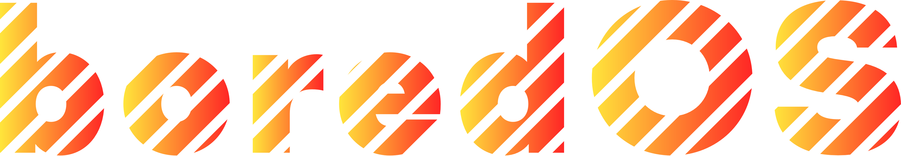

==========

A web app that cycles through informational slides, running on a dorm "whiteboard".

## Motivation

I was bored. Hence the name.

## Development

1. `npm i`
2. Add a `.env` file to the top-level directory with the contents:

		GITHUB_USER=your-username
		DARK_SKY=api-key

3. `npm run dev`: starts a local development server with hot reload.

## Building

1. `npm run build`: builds for production and puts the resulting bundle in `dist/`.